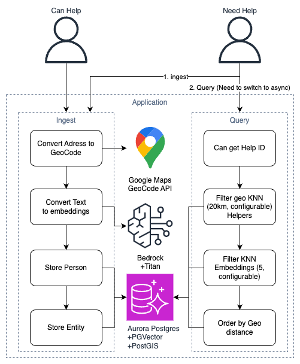

# Sample - Bedrock and Postgres for Text Embedding and GeoSpatial search



## This is example project to ingest, embed and query both textual and GeoSpatial data.
* [Postgres as central DB](https://docs.aws.amazon.com/AmazonRDS/latest/AuroraUserGuide/Aurora.AuroraPostgresQL.html)
  * [PostGIS extension for Geo Spatial queries](https://docs.aws.amazon.com/AmazonRDS/latest/AuroraUserGuide/Appendix.PostgresQL.CommonDBATasks.PostGIS.html)
  * [PGVector extenstion for embedding searches](https://aws.amazon.com/blogs/database/leverage-pgvector-and-amazon-aurora-Postgresql-for-natural-language-processing-chatbots-and-sentiment-analysis/)
* [Bedrock as serverless embedding service](https://aws.amazon.com/bedrock/)
  * [Using `Titan Embeddings G1 - Text` model](https://docs.aws.amazon.com/bedrock/latest/userguide/embeddings.html)
* Data ingestion - 
  * [using Google Maps geocode api convert Location to Bounding Box](https://developers.google.com/maps/documentation/geocoding/overview)
  * using Bedrock generate embedding of the text
  * store data in Postgres (yet to be optimized regarding data structure)
* Query best match - 
  * Query for specific entity id for best-match (geospatial & textual) from Postgres

## Stack
* Bedrock
* Postgres 15.3
* PostGIS 3
* PGVector 0.41
* TypeScript 5
* NodeJS 18
* Docker + Docker compose

## How to setup
* Require remote Postgres with PostGIS and PGVector (WIP local docker file)
* Require Docker + Docker Compose installed
* Require Google Maps API
* Require AWS Account with Bedrock permissions
* copy `./app/.env-sample` to `./app/.env` and fill all information
* Load init DB Schema located in `./db/sampleDB-dump`
* Run `docker-compose up `

## Batch Load sample Data
* ./batchLoad folder contains Node >=v18 script, which load CSV and ingest to the server
* The server needs to be up and running (mimic full flow)
* Current CSV structure: `ID,TYPE,URGENCY,NAME,PHONE,ADDRESS,TEXT`:
  * `ID` - Currently not in use
  * `TYPE` - To which route to send the row, ingestCanHelp / ingestNeedHelp
    * Possible values: `1` / `2`
  * `URGENCY` - Currently not in use
  * `NAME` - Name of the person
    * Possible values: `free text`
  * `PHONE` - Phone number of the person
    Possible values: `0524715555` / `052-4715555` / `+972524715555` / `etc.`
  * `ADDRESS` - Address of the entity
    * Possible values: `free text` (Non-valid google maps entity will fail the ingestion)
  * `TEXT` - Text entity for semantic search
    * Possible values: `free text` (embedding will be generated for it)

## Examples
### ingestNeedHelp:
```shell
curl --location 'localhost:3000/ingestNeedHelp' \
--header 'Content-Type: application/json' \
--data-raw '{
    "user": {
        "phone": "0525555555",
        "email": "example@gmail.com",
        "name": "ישראל ישראלי"
    },
    "props": {
        "text": "נוסע בדרום ",
        "address": "אשדוד"
    }
}'
```
### ingestCanHelp:
```shell
curl --location 'localhost:3000/ingestCanHelp' \
--header 'Content-Type: application/json' \
--data-raw '{
    "user": {
        "phone": "0525555555",
        "email": "example@gmail.com",
        "name": "ישראל ישראלי"
    },
    "props": {
        "text": "נוסע בדרום ",
        "address": "אשדוד"
    }
}'
```
### queryHelpToNeeded:
```shell
curl --location 'localhost:3000/queryHelpToNeeded?id=45'
```

## Deployment
* Built as components with NodeJS's Fastify server, with Docker
* Can be easly deployed as Docker with managed containers services, like ECS or EKS
* Can be also (recommended) to be ported to Lambda
* Make sure `.env` file is fully populated
  * Once deployed in AWS, `.env` file can skip `ACCESS_KEY`, and use Service Role

## TODO:
1. Switch to ORM for better DB management
1. DB:
   1. Local DB Container
   1. DB Schema
   1. Optimize DB structure
   1. Upsert Persons
   1. Reuse geocode
   1. Reuse embeddings
1. CDK Environment